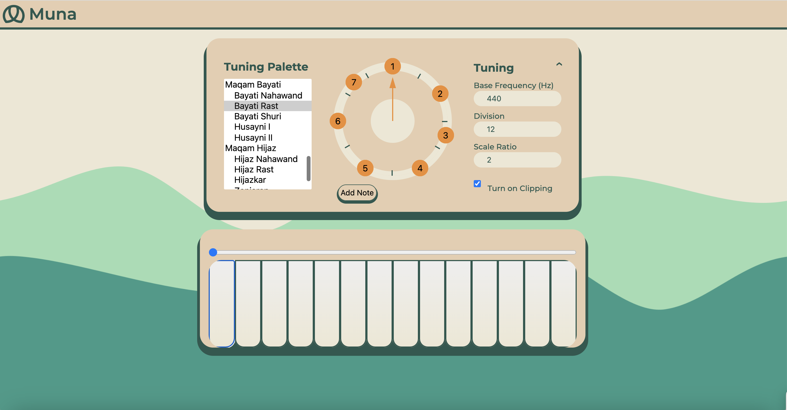

# Muna Piano 
*Muna Piano support Palestinian struggle for freedom. Glory to Palestinian people 🍉*

## 😬 A bit reasoning
Our usual piano/keyboard consists basically of 12 notes, alternating between white and black keys. The interval between each note to the next note is same, which is commonly called as semitone. 

But there's some catches:
- Sometimes we don't really need all of those 12 keys, maybe we just want to play simple pentatonic music with 5 notes. 
- This is more serious than the first one: Sometimes the 12 notes isn't sufficient because there's no key needed there. For example, in many Middle Eastern maqams/scale contains microtonal note (the interval between note may smaller than a semitone)

These issue can be easily resolved if we just **create** our own musical instrument down to tuning each specific key there.
## 🎹 What's Muna Piano? 
> Muna Piano is highly **customizable** online musical Instrument.

. It offers ability to tune specifically each key, experimenting with any musical scale, and let everyone explore many world musical tradition by supporting microtonal and non-octavian music system. **Muna Piano let you create your own musical instrument**.

## 🎶 Features 
- Ability to change music scale visually 👀
    - Scale visualisation as circle
    - Draggable note with clipping
- Easy to use piano on desktop and mobile 📱
    - Support for multitouch
- Pre-existing musical mode (western, middle eastern, asian) 🎶
    - Will be added more.. more.. and more

## 📸 Screenshots

## 🗒️ Backlogs
- More synthesizer options
- Documentation (on going)
- Support for saving and loading scale config
- Support for SCALA file format